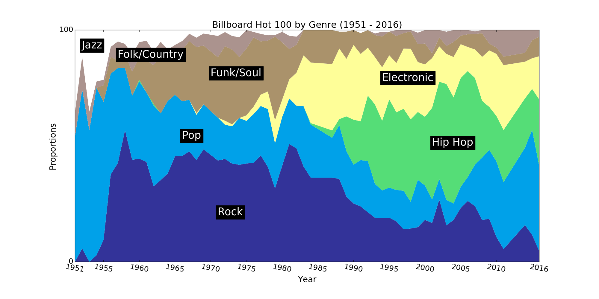

# Popular Music Genres Since the 50s

## General information
- This only looks at the songs from the year-end Billboard Top 100, and shows how the musical genres were distributed that year.
- Only the most popular genres were kept (Classical and Blues were removed among others).
- Some songs returned multiple genres, in which case all genres were kept and they all contributed to the total proportions.

## Data extraction
- Billboard data was scaped off Wikipedia articles for each year (e.g. [Billboard Year-End Hot 100 singles of 1990](https://en.wikipedia.org/wiki/Billboard_Year-End_Hot_100_singles_of_1990))
- Songs were paired up with a music genre using the [Discogs API](https://www.discogs.com/developers/).
- Some data cleaning was performed to solve cases where a genre couldn't be found e.g. removing the featuring artist.

## Code
- The visualisation code is [here](billboard_100/notebooks/visualisation.ipynb), but the data and the scraping code is not public.
